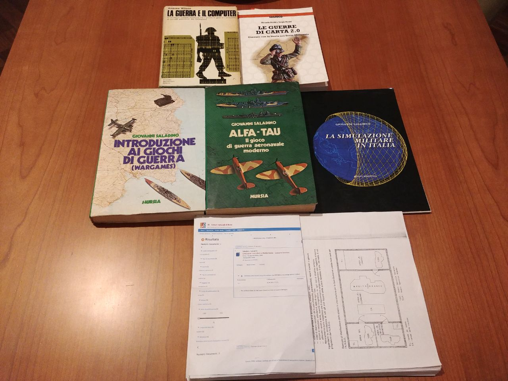

# Alfa-Tau 2.0
Ricerche e sviluppo per una nuova versione del Wargame Alfa Tau dell' Amm. Giovanni Saladino

## Introduzione

Letteralmente "folgorato sulla via di damasco" ho scoperto l'esistenza di numerosi "Giochi di guerra" che mi hanno riportato alla memoria le tante ipotesi che da ragazzo avevo fatto vedendo il famoso film "War Games". E scopro un mondo con un interessantissimo video:

Tutto questo mi ha portato alla ricerca delle fonti per il loro studio approfondito:

Una tradizione quella dei War Game che si è trasformata anche in videogame particolari appositamente creati per il mondo militare:

## Bibliografia essenziale

- Saladino, Giovanni. Introduzione ai giochi di guerra (Wargames) Milano Mursia, 1979
- Saladino, Giovanni. Alfa-tau : il gioco di guerra aeronavale moderno. Milano Mursia, 1982
- Saladino, Giovanni. Simulazioni operative in Mediterraneo Roma Rivista marittima, 1984
- Saladino, Giovanni. La simulazione militare in Italia Roma Rivista marittima, 1994

### Bibliografia correlata

- Wilson, Andrew. , and Di Giuro, Vittorio. La guerra e il computer Milano Arnoldo Mondadori, 1970
- Masini, Riccardo. , and Masini, Sergio. Le guerre di carta 2.0 : giocare con la storia nel terzo millennio. Milano Unicopli, 2018

## Collegamenti e librerie utili per la creazione di una version digitale di Alfa-Tau

Gestione coordinate:

- https://github.com/FalcoGer/CoordinateConverter
- https://en.wikipedia.org/wiki/Military_Grid_Reference_System
- https://spatialillusions.com/unitgenerator/
- https://github.com/Tronald/CoordinateSharp
- https://gist.github.com/adrianstevens/776530e198734b34a9c8a43aaf880041
- https://www.nuget.org/packages/pdfsharp/

Banca dati mezzi:

- https://www.matrixgames.com/amazon/PDF/CMO/CMO_manual_EBOOK.pdf
- https://cmano-db.com/
- https://www.tacview.net/product/en/
- http://www.warfaresims.com/?page_id=1876
- https://github.com/Vyrtuoz/Tacview

Dadi ed altro:

- https://www.nuget.org/packages/DiceRoller/
- https://www.ict.social/csharp/oop/rolling-die-in-csharp-net-constructors-and-random-numbers
- https://github.com/amulware/D20
